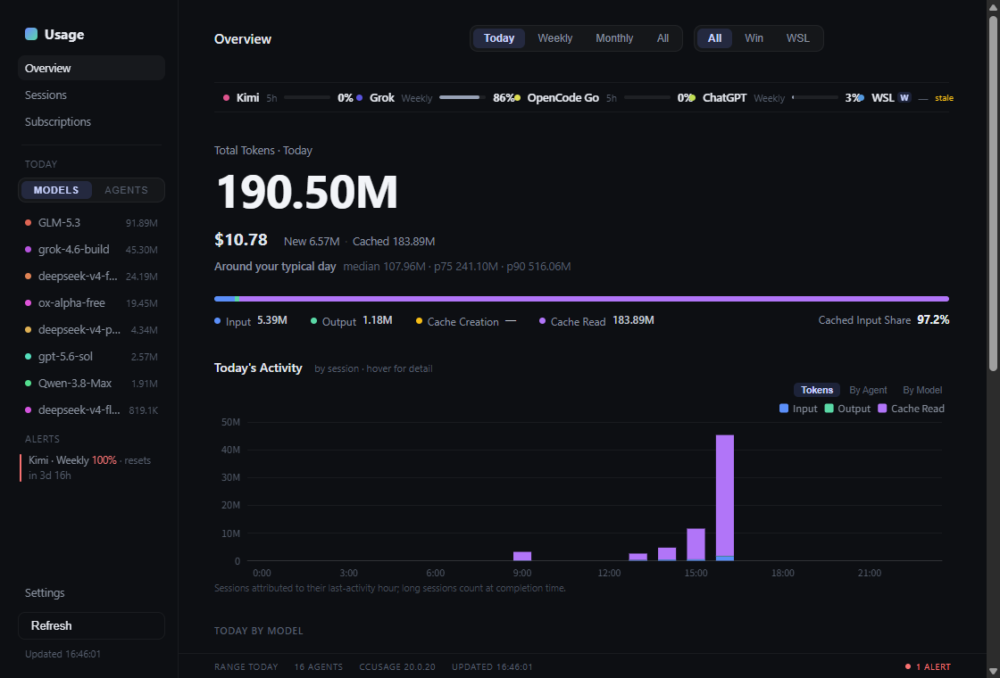
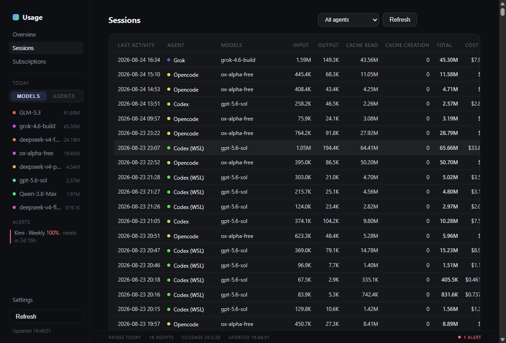
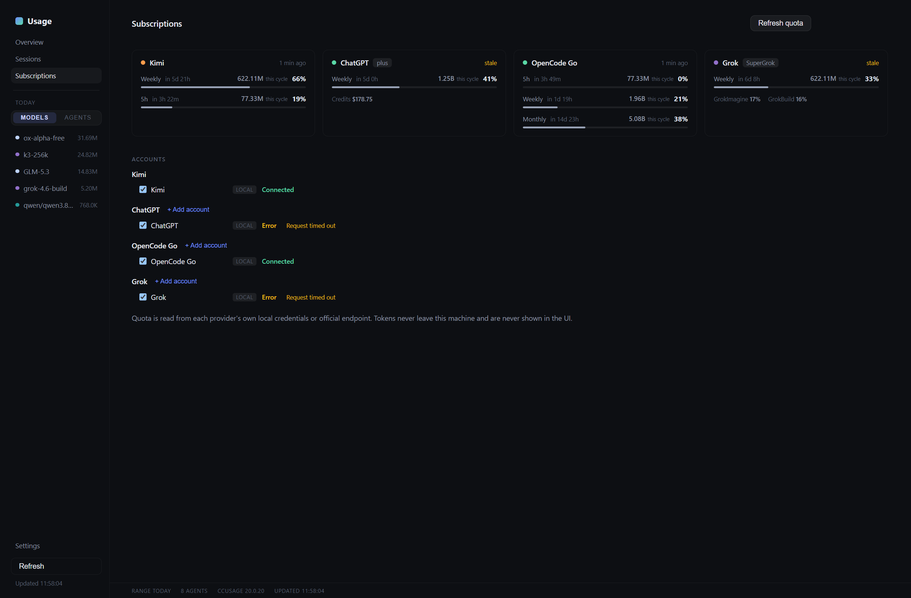
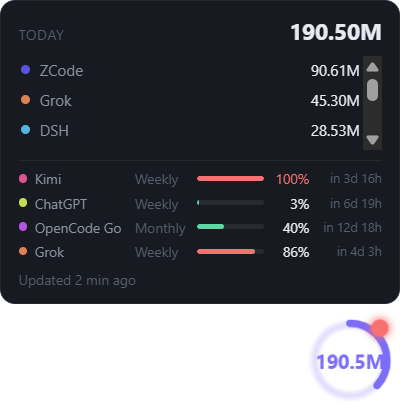
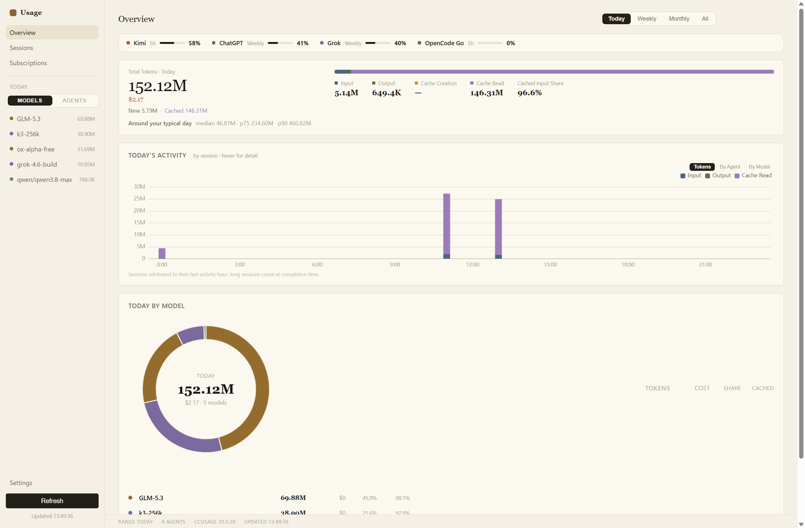
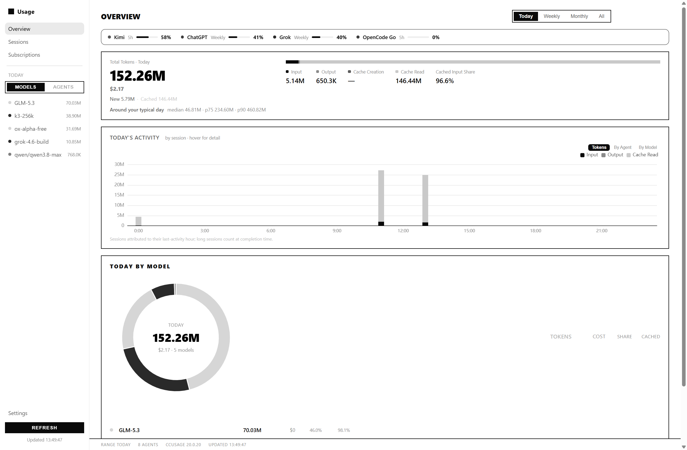
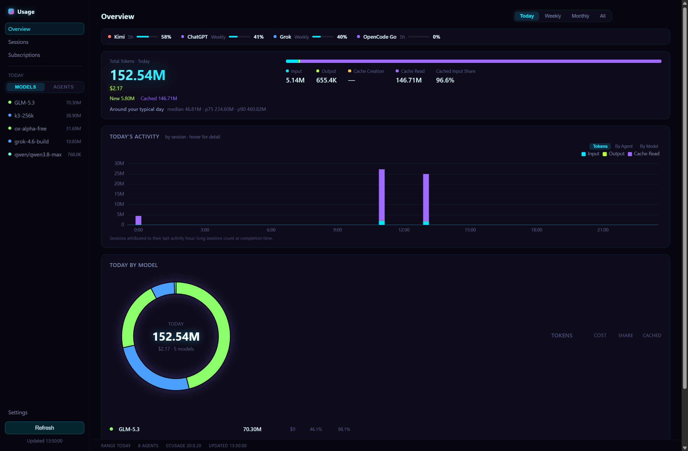
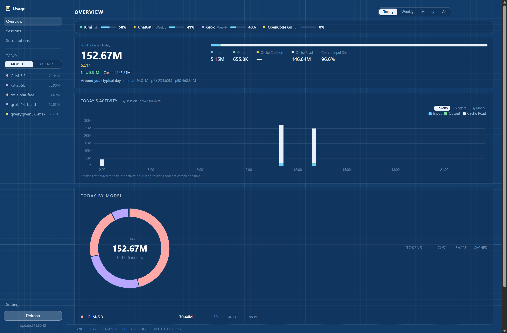

# Coding Usage Dashboard

English | [简体中文](README.md)

A Windows desktop dashboard for local AI coding usage. It uses your already-installed [ccusage](https://github.com/ccusage/ccusage) CLI as the main engine, plus direct readers for ZCode / DSH / Qoder, a Cursor collector that calls the official API with your local login, and a parallel collector for usage **inside the default WSL distro**. Open it and look — no CLI commands to remember.

**Windows 10/11 only.** Everything is computed on-device. No telemetry.

This is a personal tool that was opened up, not a complete product. Agents, subscriptions, and chart semantics were built for **what this machine actually has**. Missing pieces are meant to be added by you (or by an AI) using the extension points below.

[](LICENSE)
[](https://github.com/funzza/coding-usage-dashboard/releases)
[](https://github.com/funzza/coding-usage-dashboard/releases)



## Features

- **Multi-agent usage**: whatever ccusage reports, plus three first-party local adapters, all normalized to one model
- **WSL**: runs ccusage inside the default distro in parallel; WSL agents show up as `Claude (WSL)` etc. Missing WSL is a silent absence
- **Subscription quotas**: Kimi / ChatGPT / OpenCode Go / Grok / Cursor (the ones the author actually subscribes to), 120s polling, over-limit alerts
- **Ranges**: Today / Weekly / Monthly / All
- **Sessions**: per-session detail (**ccusage session reports only**)
- **Desktop float ball**: today's usage at a glance
- **Six skins**: Focus / Classic / Paper / Mono / Neon / Blueprint
- Tray, auto-launch, 5-minute auto-refresh, frameless window

| Sessions | Quotas | Float ball |
| --- | --- | --- |
|  |  |  |

| Paper | Mono | Neon | Blueprint |
| --- | --- | --- | --- |
|  |  |  |  |

## Which agents are supported

Usage comes from two paths. This repo does **not** ship a hardcoded list of every coding agent on earth.

### 1. Via ccusage (discovered at runtime)

Whatever `ccusage daily --json --by-agent` returns shows up in the sidebar. This repo does not maintain that list. On the author's machine that has included:

Claude · Codex · Kimi · Grok · OpenCode · Pi

If you also use Gemini or some other harness, and your installed ccusage can see it, it appears as its own agent with no code change here. When ccusage adds a provider, refresh.

### 2. First-party local adapters

Written here only for agents ccusage does not cover. Fail-soft: missing files or a schema bump become a Settings status row, not a crashed refresh.

| Agent | Data | Windows | WSL | Cost `$` | Sessions / Today bars |
| --- | --- | --- | --- | --- | --- |
| **ZCode** | `~/.zcode/cli/db/db.sqlite` | yes | yes (UNC to the WSL home) | always 0 | **no** (daily rows only) |
| **DSH** | `~/.dsh/sessions/**/session.jsonl.zstd` | yes | yes | always 0 | **no** |
| **Qoder** | `%APPDATA%/QoderCN/.../local.db` | yes | **no** | always 0 | **no** |
| **Cursor** | Cursor official API (local login) | yes | **no** | yes (numeric CSV rows; `Included` counts as 0) | **no** (daily rows only) |

Cursor is not a local file source: it calls the official API with your local login (`usage-summary` + a usage CSV). Auth and semantics: the header comments in `src/main/cursor/`.

If ccusage later reports the same agent name, the local adapter steps aside (`covered by ccusage`) so counts are not doubled.

## Quotas: only the subscriptions the author has

Quota cards are a separate pipeline from usage. Usage can display anything ccusage already knows; quotas have to hit undocumented endpoints, which cannot be written or tested without an account. So the app only has:

| Provider | Local credential | Paste extra tokens | WSL |
| --- | --- | --- | --- |
| Kimi | local `kimi web` (`~/.kimi-code/server.token`) | no (local server) | yes (`local-wsl:kimi`) |
| ChatGPT / Codex | `~/.codex/auth.json` | yes | no |
| OpenCode Go | `opencode-go.key` in OpenCode `auth.json` | yes | no |
| Grok | `~/.grok/auth.json` | yes | no |
| Cursor | Cursor login (`state.vscdb`, see table above) | no (local login only) | no |

**Not built** (the author does not subscribe): Claude Max/Pro quota, Gemini, GitHub Copilot, Alibaba Token Plus, and anything else.

Those endpoints are what the CLIs themselves call, not a stable public API. When they drift, the app degrades to error / empty windows. Tokens are DPAPI-encrypted at rest and decrypted only in the main process.

## Known issues and limitations

Read this before installing or sending the repo to an AI. These are current design choices, not forgotten UI copy.

1. **The Today bar chart is not real hourly consumption.**  
   It is built from `ccusage session`. Each session's **entire token count** is placed in the local hour of `lastActivity`. A session that runs 09:00–17:00 becomes one fat bar at 17:00; the hours in between stay empty. The caption under the chart (*Sessions attributed to their last-activity hour; long sessions count at completion time.*) is literal.  
   In-progress sessions: the Today total on the hero comes from `ccusage daily` and often already includes them; the bars wait until the session appears in the session report. The usual experience is that a bar shows up when the session ends (or when ccusage writes `lastActivity`). Rows with no `lastActivity` are dropped.

2. **Today's hero numbers and the bars are not supposed to match.**  
   Totals / donut come from `daily` (includes ZCode / DSH / Qoder). Bars come from `session` (**excludes** those three). Two commands, two caches (session also takes 1–2 minutes and has a 5-minute TTL). Do not "fix" the mismatch without changing the semantics on purpose.

3. **The Sessions page is ccusage-only.**  
   ZCode / DSH / Qoder have no session adapter, so they never appear in that table.

4. **Few quota providers.** See the previous section. Adding one means following the quota extension steps and having a live login.

5. **`$` is incomplete.** Only ccusage estimates cost. ZCode / DSH / Qoder set `totalCost` to 0, so the grand total is low.

6. **Only the default WSL distro is collected.** Distros you installed besides the default are ignored. Qoder has no WSL adapter.

7. **Refresh is slow and infrequent.** `ccusage daily` is often tens of seconds; `session` can take 1–2 minutes. Auto-refresh is every 5 minutes; quotas every 120 seconds. An in-flight guard stops parallel ccusage spawns.

8. **Kimi quota needs `kimi web` running locally.** Grok JWTs last ~6 hours; when they expire, open the Grok CLI once and let it refresh. This app will not run OAuth itself.

9. **Windows only, unsigned installer, no auto-update.** SmartScreen may warn once. macOS / Linux are not supported (`where.exe`, DPAPI, HKCU, WSL UNC).

10. **Cursor usage and quotas depend on the official API plus a local login.** Cursor must be signed in on this machine; when the token expires (Cursor not opened for a while) the row shows skipped/error on Settings until you open Cursor once. The CSV only covers events Cursor actually reported (daily rows, no sessions); column semantics: the header comment in `src/main/cursor/adapter.ts`.

Some remaining behavior is honestly upstream-unknown: when ccusage emits in-progress sessions in `session --json`, when quota JSON fields get renamed, when ZCode/DSH/Qoder schema changes trip the guards. The source-status rows on Settings are the place to look.

## Install

### 1. Install ccusage (not bundled)

```powershell
npm install -g ccusage
```

The app never downloads or pins ccusage. Missing install → in-app setup page.

### 2. Download the installer

Grab `coding-usage-dashboard-setup-x.y.z.exe` from [Releases](https://github.com/funzza/coding-usage-dashboard/releases). Per-user, no admin. Not code-signed: SmartScreen → "Run anyway".

### 3. Optional: WSL usage

Inside the **default distro** (not under `/mnt/c`):

```bash
npm install -g --prefix ~/.local ccusage
```

Put `~/.local/bin` on PATH. Windows and WSL stay separate; switch with All / Win / WSL.

### 4. Optional: quotas

Log in with the corresponding CLI. ChatGPT / OpenCode Go / Grok also accept pasted tokens on Subscriptions for extra accounts.

## How it is built

Three layers, one contract. The renderer never touches the filesystem, never sees tokens, never spawns processes.

```
Vue 3 UI  (src/renderer)
    │  IPC (preload allow-list)
    ▼
Electron main
    ├─ src/main/usage/service.ts     locate ccusage → run JSON → merge extra sources
    │     ├─ ccusage/                Windows daily / session
    │     ├─ wsl/                    same inside the default distro, origin=wsl
    │     ├─ zcode/  dsh/  qoder/    registered on EXTRA_SOURCES[]
    │     ├─ cursor/                  official API with local login (async API source)
    │     └─ fail-soft merge into UsageSnapshot
    └─ src/main/quota/service.ts     PROVIDERS[] registry, 120s poll
          tokens stay in main; DPAPI at rest

src/shared/usage-model.ts   normalized DailyUsage / SessionUsage / SourceStatus
src/shared/analytics.ts     chart semantics (Today buckets by lastActivity)
src/shared/agents.ts        agent key ↔ label (kimi@wsl → "Kimi (WSL)")
```

A refresh spawns **one** Windows ccusage process; the WSL side runs in parallel. Extra sources merge after the snapshot. If ccusage starts covering the same agent, the local source is skipped.

Quotas are a second pipeline: local credentials → each provider's usage endpoint → `QuotaWindow[]` (percent + reset time). Parsers assume fields may be missing.

The UI only consumes snapshots. Skins are CSS variables in `src/shared/skins.ts` plus `[data-skin]` overrides in `skins.css`.

## Keep building this with an AI

The layout is meant to be continued: one folder per adapter, registries in one place, Vue forbidden from knowing raw schemas. Paste the block below plus your goal.

Have the model read first:

- `src/shared/usage-model.ts` — output contract for every adapter
- `src/main/usage/service.ts` — `EXTRA_SOURCES` / `wslFileSources` / `doGetSessions`
- `src/main/zcode/` — local usage adapter template (reader + adapter + fail-soft `collect*`)
- `src/main/cursor/` — **API-based** usage adapter template (official client login + official endpoints, async `collect*`)
- `PROVIDERS` in `src/main/quota/service.ts`, plus `src/main/quota/grok.ts` or `src/main/quota/cursor.ts`
- `PROVIDER_META` in `src/renderer/src/pages/Subscriptions.vue`
- `src/shared/skins.ts` and `src/renderer/src/skins.css`

Hard rules:

- Adapter failure must be `{ daily: null, status: { state: 'skipped' | 'absent', reason } }`. Never throw through the ccusage path
- Raw JSON/SQLite types stay in that adapter folder; `renderer/` may import `shared/` only
- Quota tokens must not appear in IPC views, logs, or Vue
- API-based sources (Cursor) read only the official client's own login; never implement OAuth refresh yourself (it races the client's credential file)
- Do not distort daily totals to make the Today bars look nicer; bar semantics live in `sessionsHourlyBuckets` (`src/shared/analytics.ts`)

### Add an agent ccusage does not cover

1. Copy `src/main/zcode/` : `reader.ts` locates/queries, `adapter.ts` emits `DailyUsage[]`, `index.ts` is fail-soft `collect*`
2. Register Windows in `EXTRA_SOURCES`; register WSL in `wslFileSources` if the files also live in the WSL home
3. Add a display name in `DISPLAY_NAMES` (`src/shared/agents.ts`)
4. Tests like `zcode/adapter.test.ts`; real-db integration uses `describe.skipIf`
5. **Sessions / Today bars will not show this agent** until you also emit `SessionUsage[]` and merge them in `doGetSessions` (none of the four adapters do that today)
6. Cost: compute it, or leave 0

> An agent with no readable local data that must hit an official API (like Cursor) is an **API-based source**: follow `src/main/cursor/` (auth from the official client's login → api fetch → adapter normalize). In `EXTRA_SOURCES`, `collect` returns `Promise<SourceCollectResult>` and `mergeExtraSources` awaits it. Read only the official client's own login; never implement OAuth refresh.

### Add a quota provider

1. Copy `src/main/quota/grok.ts`: read credentials, GET the endpoint, parse `QuotaWindow[]`
2. Extend `QuotaProviderId`, register on `PROVIDERS`, add a row to `PROVIDER_META`
3. You need a live login to test. The author cannot add providers they do not pay for
4. Do not implement OAuth refresh (it races the CLI's credential file). On 401, tell the user to open the official CLI once

### Change Today bar semantics

They are intentionally "whole session in the lastActivity hour". Spreading across a start–end range needs a start timestamp in ccusage's session JSON (the adapter currently reads only `metadata.lastActivity`). Change `sessionsHourlyBuckets` and the caption together. Do not pretend it is precise hourly metering.

### Add a skin

Add a descriptor to `SKINS` in `src/shared/skins.ts`, then `[data-skin='id']` rules in `skins.css`. Charts use the `series` palette.

### Prompt you can paste

```
I am working on coding-usage-dashboard (Electron + Vue 3 + TypeScript) on Windows.
Read README.md sections "How it is built", "Known issues and limitations", and "Keep building this with an AI",
plus src/shared/usage-model.ts and src/main/usage/service.ts.

Goal: <one sentence, e.g. "add a Gemini CLI usage adapter" or "add a Claude quota card">

Constraints: fail-soft, tokens never leave main, renderer depends on shared only, do not break Windows-only APIs.
Follow src/main/zcode/ or src/main/quota/grok.ts. List the files you will change before editing.
```

Directory rules: [CONTRIBUTING.md](CONTRIBUTING.md).

## Develop

Windows 10/11, Node.js 20+.

```powershell
git clone https://github.com/funzza/coding-usage-dashboard.git
cd coding-usage-dashboard
npm install
npm run dev
npm test           # integration tests skip when the local source is absent
npm run typecheck
npm run build
npm run dist       # NSIS installer in dist/ (does not publish)
```

Stack: Electron · Vue 3 · TypeScript · electron-vite · ECharts · Pinia

## Privacy

- Reads data already on this PC (and the WSL filesystem). Nothing is uploaded
- No accounts, no telemetry, no analytics SDK
- Pasted quota tokens are DPAPI-encrypted; logs and errors are redacted

## License

[MIT](LICENSE)

Not affiliated with Anthropic, OpenAI, xAI, Moonshot, OpenCode, or any of the CLIs this app reads.
