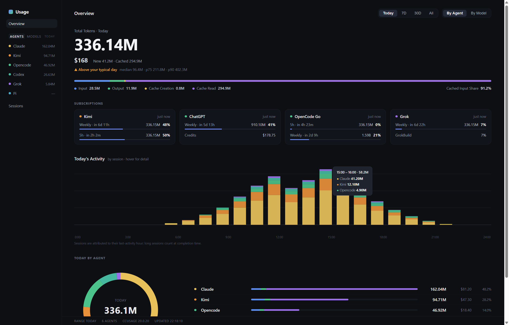
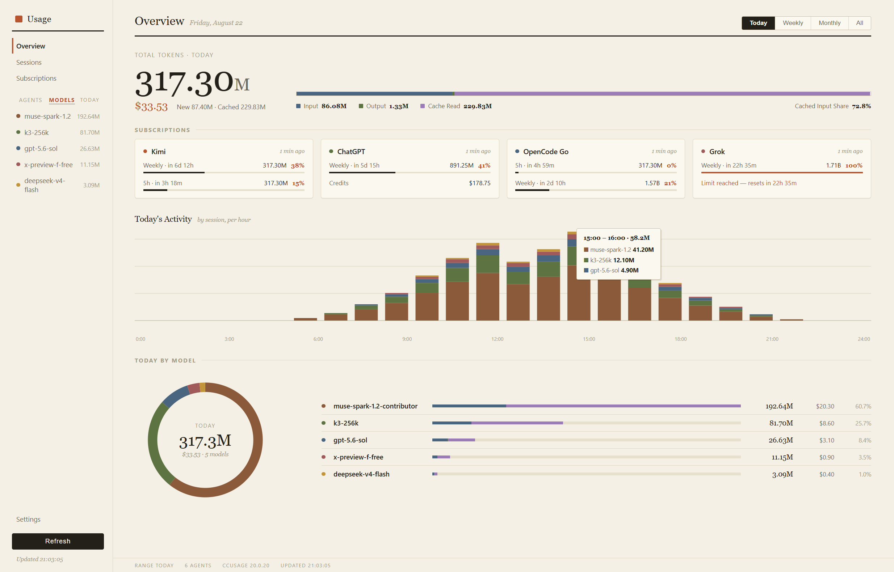
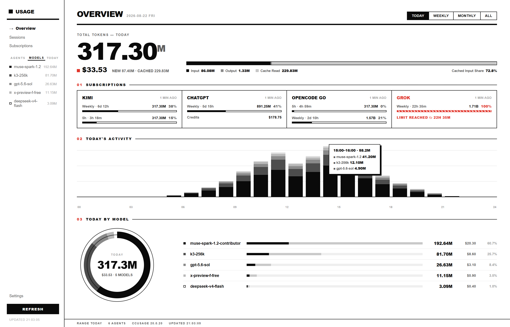
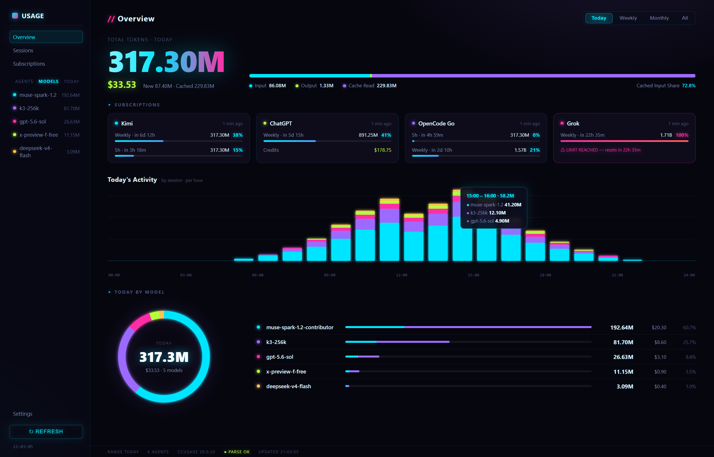
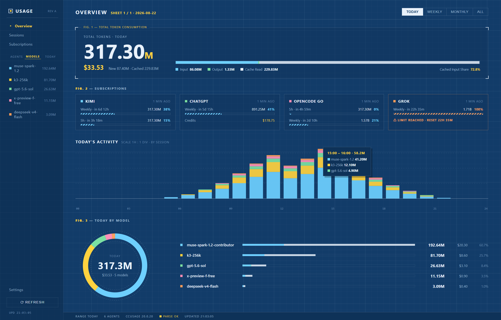

# Coding Usage Dashboard

Windows 本地 AI Coding 用量仪表盘。以本机已安装的 [ccusage](https://github.com/ccusage/ccusage) 作为唯一主要数据引擎,打开即看,不用再记任何 CLI 命令。



## 功能

- **多 Agent 用量聚合**:ccusage 覆盖的 Claude / Codex / Kimi / Grok / OpenCode 等,外加本地直读适配的 **ZCode**(SQLite)、**DSH**(zstd JSONL)、**Qoder**(SQLite),统一归一化成一套数据模型
- **订阅额度监控**:Kimi / ChatGPT / OpenCode Go / Grok,支持每类多账号,120s 轮询,超限预警
- **多时间维度**:Today(24h 活动图)/ Weekly / Monthly / All,饼图、柱状图、趋势图、星期节律随维度切换
- **Sessions 维度**:按会话查看用量明细
- **桌面悬浮球**:今日用量外显,悬停展开明细,单击唤起主窗口
- **六套皮肤**:Focus / Classic / Paper / Mono / Neon / Blueprint,字体、控件、图表、悬浮球整套切换
- 系统托盘常驻、开机自启动、自动刷新、无边框窗口

| Paper | Mono | Neon | Blueprint |
| --- | --- | --- | --- |
|  |  |  |  |

## 安装

**前置条件**:本机已全局安装 ccusage(应用不自带、不下载、不锁定版本):

```powershell
npm install -g ccusage
```

然后从 [Releases](../../releases) 下载最新的 `Coding Usage Dashboard Setup x.y.z.exe`,双击安装即可(单用户安装,无需管理员权限)。未检测到 ccusage 时应用会给出安装引导页。

## 数据源与架构边界

```
Claude / Codex / Kimi / Grok / OpenCode / ... ──> 本机 ccusage ──┐
ZCode (~/.zcode/cli/db/db.sqlite) ──────────────────────────────┤
DSH  (~/.dsh/sessions/**/session.jsonl.zstd) ───────────────────┼──> Normalized Model ──> Dashboard
Qoder (%APPDATA%/QoderCN/.../local.db) ─────────────────────────┘
```

- ccusage 是唯一主引擎;ZCode / DSH / Qoder 作为额外源以 fail-soft 方式合并,任何一个失败都不影响主链路
- 所有适配器都有 schema 守卫:上游格式升级时跳过并在 Settings 页显示原因,不会静默出错数据
- 额度 token 用 DPAPI(safeStorage)加密后落盘,只用于本地请求,永不出本机

## 开发

```powershell
npm install        # 安装依赖
npm run dev        # 开发模式(HMR)
npm test           # vitest(含真实本机库的集成测试,无库环境自动跳过)
npm run typecheck  # tsc --noEmit
npm run build      # 构建到 out/
npm run dist       # 打包 NSIS 安装包到 dist/
```

技术栈:Electron · Vue 3 · TypeScript · electron-vite · ECharts · Pinia

## 隐私

全部数据都在本机读取和计算,无任何遥测、无上报。额度凭据加密存储,UI 永不显示明文。
